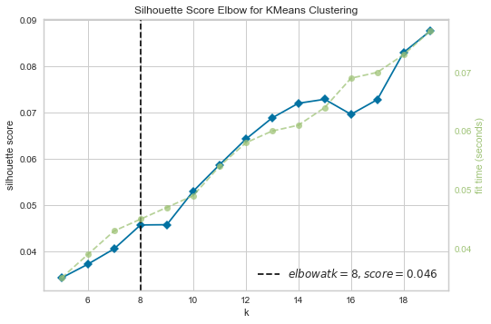
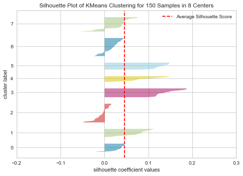
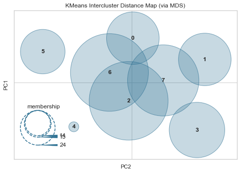

# Overview of Automated Document Clustering

Textual data will be scrapped from Wikipedia articles (in different languages) for the purpose of this exercise. The various texts will then have their languages detected and will be translated to English. All texts will then be handled in an English based approach, from processing to vectorization and clustering. Clusters will then be analysed to try to determine what they represent.

### Installation of Dependencies
```bash
pip install -r requirements.txt
```

### Run Scripts
- Full Workflow
```bash
python ./src/main.py
```
- Scrape & Translate Only
```bash
python ./src/scrape.py
```
- Modified Workflow (In the event of API downtime)
```bash
python ./src/modified.py
```

Note: 
- Reproducibility could be an issue across different machines 
- [backup.ipynb](src/backup.ipynb) can be referred to to view the obtained results

# Document Extraction

The text summary for the [Top 50 Wikipedia Pages in 2019](https://en.wikipedia.org/wiki/Wikipedia:2019_Top_50_Report) (excluding certain non-articles) will be extracted using [Wikipedia-API](https://pypi.org/project/Wikipedia-API/). Certain topics of interest are added to replace the exclusions. The 50 articles will be extracted in English, French and Chinese. A total of 150 articles will be extracted and stored locally in [text.csv](src/files/text.csv) which can be used in the event of downtime of Wikipedia's API. The code for the extraction can be viewed [here](src/scrape.py). 

# Language Detection

The Google Translate API will be used to automatically detect the language of the texts and translate them to English. [Googletrans](https://pypi.org/project/googletrans/) is used for this purpose. Since text of different languages may need to be handled differently (eg. different pre-processing steps), the decision was made to translate all text into English was made in order to simplify the workflow and generalise for multiple languages, considering the [language support](https://cloud.google.com/translate/docs/languages) that Google Translate provides. 

The translated text and detected language will be stored locally in [text_translated.csv](src/files/text_translated.csv) which can be used if the package in unstable. The code for the language detection and translation can be viewed [here](src/scrape.py).

### Correctness of Detected Language

Since the language of text was known during extraction, we can verify that 100% accuracy was achieved in detecting the correct language for each article. 

# Text Processing

The texts will be pre-processed using the following steps:
- Removal of non-ASCII characters (non-translated foreign characters)
- Removal of punctuation
- Tokenization & removal of whitespace
- Conversion to lowercase
- Removal of stop words
- Lemmatization
   
## Vectorization

[TF-IDF](https://scikit-learn.org/stable/modules/generated/sklearn.feature_extraction.text.TfidfVectorizer.html) will be used to transform the text into numerical vectors which can be compared. 

Reasons for choosing TF-IDF:
- Simple to understand and implement
- Common/Irrelevant words can be filtered out while retaining the important/descriptive words
- A metric exists to determine the most descriptive words in an article 

## Dimensionality Reduction

We then perform a Low-Rank Approximation using [Truncated Singular Value Decomposition](https://scikit-learn.org/stable/modules/generated/sklearn.decomposition.TruncatedSVD.html) to speed up runtimes, considering that the matrix is sparse.

# Clustering

The [K-Means](https://scikit-learn.org/stable/modules/generated/sklearn.cluster.KMeans.html) clustering algorithm will be used to group the texts according to their distance in the vector space. [Euclidean Distance](https://en.wikipedia.org/wiki/Euclidean_distance) is used as the metric for distance measure.

Reasons for choosing K-Means:
- Simple to understand and compute
- Convergence is guaranteed
- Relatively scalable

Assumptions made:
- Clusters are spherical
- Clusters are of similar size

These [assumptions](https://www.r-bloggers.com/k-means-clustering-is-not-a-free-lunch/) are made so that clusters computed are meaningful and representative. [Extensions](http://www.cs.cmu.edu/%7Eguestrin/Class/10701-S07/Slides/clustering.pdf) to the algorithm can be made to address these assumptions, but will not be explored in this exercise.

## Choosing K

The [Elbow Method](https://www.scikit-yb.org/en/latest/api/cluster/elbow.html) is used to help determine the optimal number of clusters K. However, instead of inertia (Sum of squared distances to cluster centroids), the mean [Silhouette Score](https://en.wikipedia.org/wiki/Silhouette_(clustering)), which measures how similar an object is to its own cluster compared to other clusters, is plotted against a range of values of K. 



Since the number of documents is small, the search for K is kept to a reasonable range of 5 to 20. The optimal K is chosen using the [kneedle algorithm](https://github.com/arvkevi/kneed). In essence, the optimal K is chosen where increase in K gives marginal improvement in score. **K = 8** is chosen as shown above, although K = 15 might be a suitable choice as well.

# Results

## Mismatched Articles

Mismatching of the articles occurs when the clustering algorithm groups the same article in different languages to different clusters. This may be because these articles are significantly different as they are not direct translations of each other. Significant information could also have been lost during translation. 

| Mismatched Article | Mismatched Language |
|---|---|
| Central Park jogger case  | zh |
| Elon Musk | zh  |
| Jason Momoa  | en |
| Joker (2019 film) | en  |
| Kamala Harris  | fr  |
| Nipsey Hussle | fr  |
| Keanu Reeves  | No majority cluster  |

The table above depicts the 7 (14%) mismatched articles. We assume that the correct cluster is the majority cluster among the 3 languages for each article. The mismatched language is defined as the language for the article in the wrong cluster. All 3 languages seem to be mismatched in equal proportions. An outlier (the article on "Keanu Reeves") exists without a majority cluster. In this case, we assume that the English version of the article is clustered correctly as it is least likely to suffer from information loss during translation.


## Cluster Representations

| Cluster  | Articles  |
|---|---|
| 0 | 'Alexandria Ocasio-Cortez', 'Donald Trump', 'Jeffrey Epstein', 'Ted Bundy'  |
| 1 | 'Bradley Cooper', 'Joaquin Phoenix', 'Joker (2019 film)', 'Nipsey Hussle', 'Rami Malek'  |
| 2 | 'Bonnie and Clyde', 'Cameron Boyce', 'Chernobyl disaster', 'Jason Momoa', 'Luke Perry', 'Once Upon a Time in Hollywood', 'Star Wars: The Rise of Skywalker', 'The Irishman', 'The Lion King (2019 film)', 'Us (2019 film)'  |
| 3 | 'Avengers: Endgame', 'Captain Marvel (film)', 'List of Marvel Cinematic Universe films', 'Marvel Cinematic Universe', 'Spider-Man: Far From Home'  |
| 4 | 'Game of Thrones', 'Game of Thrones (season 8)', 'The Mandalorian' |
| 5 | 'Artificial intelligence', 'Data Science', 'Machine learning', 'Natural language processing'  |
| 6 | '2019 Indian general election', 'Cristiano Ronaldo', 'Dwayne Johnson', 'Elon Musk', 'India', 'Kamala Harris', 'Singapore', 'TikTok', 'United States', 'YouTube'  |
| 7 | 'Billie Eilish', 'Central Park jogger case', 'Elizabeth II', 'Elton John', 'Freddie Mercury', 'Keanu Reeves', 'Lady Gaga', 'Queen (band)', 'Scarlett Johansson'  |

The above table shows the articles belonging to each cluster. Using this information, we can try to deduce what each cluster represents. 

There are certain clusters (3/4/5) with obvious representations while some are somewhat ambiguous. Cluster 3 represents Marvel-related topics. Cluster 4 represents various television series. Cluster 5 represents topics related to Artifical Intelligence/Machine Learning. Cluster 0 seems to represent people related to US politics while both Clusters 1 and 2 seem to represent topics related to the film industry. 

## Visualizations



The above image shows the silhouette scores for each cluster. Clusters 3, 4 and 5 (with the highest silhouette scores) seems to be the most clear and distinct, which is consistent with our observations from before.



The above image shows a visualization of the [clusters in a 2D vector space](https://www.scikit-yb.org/en/latest/api/cluster/icdm.html). Again, clusters 3, 4 and 5 are mostly distinct. There seems to be some overlap between clusters 0, 2, 6 and 7, although overlaps in this 2D space may not imply actual overlaps in the original vector space. The close proximity of these cluster centroids could imply that they share certain similarities.

# Conclusion

The clustering algorithm seems to have performed decently, even with the small dataset. With more data from various sources, performance is likely to improve, given the wider range of topics to form more distinct clusters and a more representative corpus.

There are several potential changes that could be futher explored to improve performance, though at the cost of increasing complexity. 

- Instead of utilizing translation, which may increase errors and degrade performance, we can handle each language seperately. However, different text processing pipelines would need to be set up due to the different needs for different languages. 
  
- Embeddings have also been traditionally language specific. Multilingual embeddings can be used to address this issue, where embeddings for every language exist in the same vector space, and maintain the property that words with similar meanings (regardless of language) are close together in vector space. Facebook has an article on this topic [here](https://ai.facebook.com/blog/under-the-hood-multilingual-embeddings/).

- Training an autoencoder to be used for dimensionality reduction could be useful by applying non-linear transformations, better representing the data in a lower dimensonal vector space.